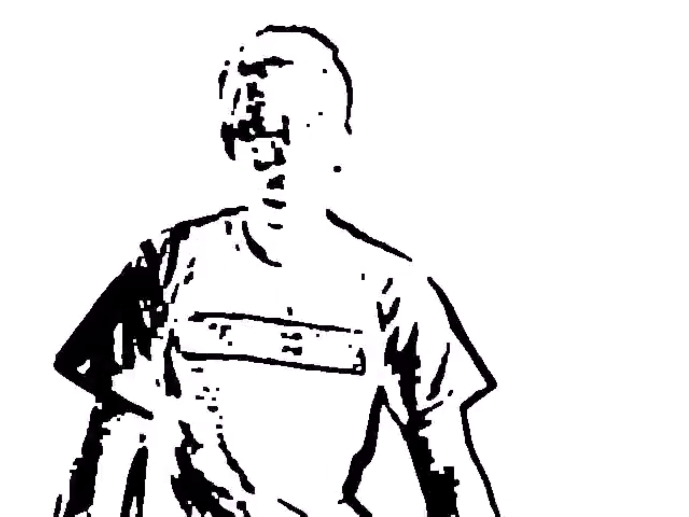
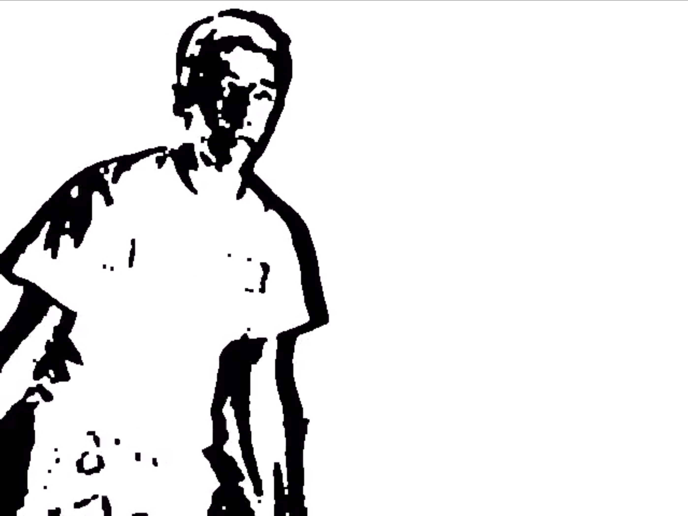

Motion-detection-OpenCV
=======================

Python/OpenCV script that detect motion on webcam and allow record it to a file.

## The simple way ##

The trivial idea is to compute the difference between two frames apply a threshold the separate pixels that have changed from the others and then count all the black pixels. Then the average is calculated with this count and the total number of pixels and depending of the ceil the event is triggered or not.

**Additional informations:**

* initRecorder: initialise the recorder with an arbitrary codec it can be changed with problems
* in the run method no motion can be detected in the first 5 second because it is almost the time needed for the webcam to adjust the focus and the luminosity which imply lot's of changes on the image
* processImage: contains all the images operations applied to the image
* somethingHasMoved: The image iteration to count black pixels is contained in this method
## 📸 Screenshots

Motion detection in action:

## The smart way ##

Iis way to operate is less trivial than the previous one, but the results are identical if not more accurate in the previous method. I inspired myself of the [Motion-tracker]("https://github.com/mattwilliamson/Motion-Tracker/") by Matt Williamson for the operations and filters to apply on the image but all the rest is different. The idea in this method is to find the contours of the moving objects and calculate the area of all of them. Then the average of the surface changing is compared with the total surface of the image and the alarm is triggered if it exceed the given threshold. Note the code shown below does not implement the recording system as it is the case on the previous example, but it can be made easily.

